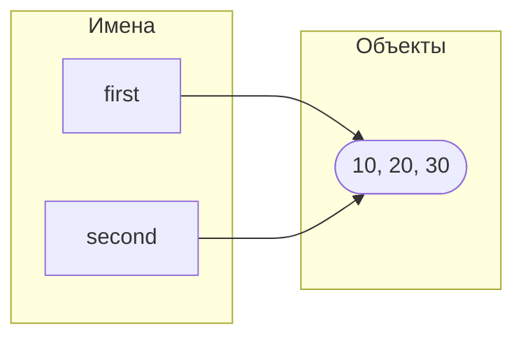
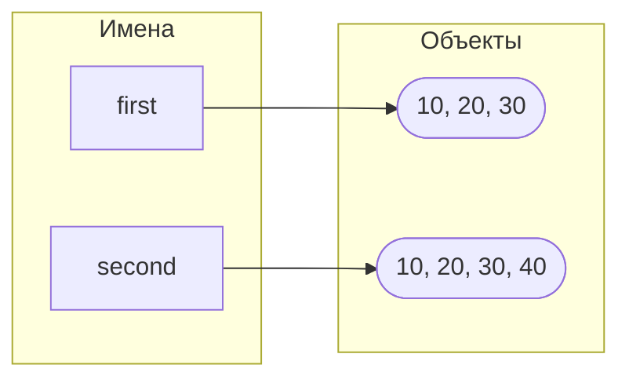

# Лабораторная работа № 2. Управление объектами и памятью в Python

## Цель работы

Исследовать связь между именами и объектами, понять различия между присваиванием, поверхностным и глубоким копированием, а также познакомиться с механизмами управления памятью в CPython.

### Задание 1. Имена, ссылки и изменяемость.

#### Эксперимент A. Неизменяемый объект.

Результат вывода:

```python
10 10
4360002920 4360002920
11 10
4360002952 4360002920
```

Значение, связанное с именем b, не поменялось так как имя a создало новый объект в памяти и теперь ссылается на него

#### Эксперимент B. Изменяемый объект.

Результат вывода до изменения кода:

```python
[10, 20] [10, 20]
4309502336 4309502336
[10, 20, 30] [10, 20, 30]
4309502336 4309502336
```
Дополняем код следующими строками:

```python
second = first.copy()
print('second == first: ', second == first)
print('second is first: ', second is first)
second.append(40)
print(first, second)
```
И можем наблюдать, что добавление нового элемента в список `second` не повлияло на список `first`:

```python
second == first:  True
second is first:  False
[10, 20, 30] [10, 20, 30, 40]
```
Схема связей до переназначения:



И после:



---
Практическая задача

Результат вывода двух конфигураций, одна из которых была сделана обычным присваиванием:

```python
Учебный проект №1:
{'Name': 'Основы программирования', 'Students': ['Лиза', 'Вика'], 'Starts': {'Duration (sec)': 10, 'Amount': 2}}

Учебный проект №2:
{'Name': 'Основы программирования', 'Students': ['Лиза', 'Вика'], 'Starts': {'Duration (sec)': 10, 'Amount': 2}}
```

Попытаемся поменять название учебного проекта в `project2` и выведем названия двух проектов:

```python
Введение в Linux
Введение в Linux
```

Мы получили нежелательное совместное изменение
Создадим независимую конфигурцию `project2` путем использования `copy.deepcopy(project1)`. В данном случае у нас создается глубокая копия (со всеми данными внутри словаря), но две конфигурации теперь ссылаются на два разных объекта в памяти. Поменяем данные в `project2` и подтвердим независимость с помощью `assert`:

```python
project2['Name'] = 'Алгоритмы и структуры данных'
project2['Students'] = ['Сережа', 'Рита', 'Лиза', 'Аня']

assert project1['Name'] == 'Основы программирования'
assert project1['Students'] == ['Лиза', 'Вика']

assert project2['Name'] == 'Алгоритмы и структуры данных'
assert project2['Students'] == ['Сережа', 'Рита', 'Лиза', 'Аня']
```
Вывод двух конфигураций и общих объектов:

```python
Учебный проект №1:
{'Name': 'Основы программирования', 'Students': ['Лиза', 'Вика'], 'Starts': {'Duration (sec)': 10, 'Amount': 2}}

Учебный проект №2:
{'Name': 'Алгоритмы и структуры данных', 'Students': ['Сережа', 'Рита', 'Лиза', 'Аня'], 'Starts': {'Duration (sec)': 10, 'Amount': 2}}

Общие объекты:
Name, Students, Starts, 10, 2, Лиза
Остальные объекты являются независимыми
```

Если бы независимость не подтвердилась, то нам выдавало бы ошибку `AssertionError`

**Вопросы:**

1. Нет, не меняет, а всего лишь создает еще одно имя, которое будет ссылаться на тот же объект, что и первое имя
2. Потому что в Python нельзя изменять неизменяемый объект в памяти, поэтому при любой операции с ним в памяти создается новый измененный объект
3. С помощью оператора `is`

### Задание 2. Поверхностное и глубокое кодирование

Вывод четырех структур после изменений:

```python
Первое изменение
Идентификаторы внешних списков: original = 4371359232, alias = 4371359232, shallow = 4371358720, deep = 4371447424
Идентификаторы первого вложенного списка: original = 4370501760, alias = 4370501760, shallow = 4370501760, deep = 4371447296
Идентификаторы объекта первой оценки: original = 4390968520, alias = 4390968520, shallow = 4390968520, deep = 4390968520

Второе изменение
Идентификаторы внешних списков: original = 4371359232, alias = 4371359232, shallow = 4371358720, deep = 4371447424
Идентификаторы первого вложенного списка: original = 4370501760, alias = 4370501760, shallow = 4370501760, deep = 4371447296
Идентификаторы объекта первой оценки: original = 4390968456, alias = 4390968456, shallow = 4390968456, deep = 4390968520
```

Таблица наблюдений:

| Операция | Новый внешний объект | Новые вложенные объекты | Изменения независимы |
|---|---|---|---|
| Присваивание | нет | нет | нет |
| Поверхностная копия | да | нет | частично |
| Глубокая копия | да | да | да |

---

Вывод ошибочного создания матрицы:

```python
[1, 0, 0]
[1, 0, 0]
[1, 0, 0]
```
Вывод корректного создания матрицы:

```python
[0, 0, 0]
[0, 0, 0]
[0, 0, 0]
```

Проверим идентичность с помощью оператора `is`:

```python
Проверка:
Идентичны ли 1 и 3 строчки в wrong_matrix: True
Идентичны ли 1 и 3 строчки в correct_matrix: False
```
Из-за того, что в `wrong_matrix` мы создаем три вложенных списка через умножение на 3, получаем три одинаковых списка, которые в памяти хранятся как один и тот же объект, поэтому при попытке изменить первый элемент первого вложенного списка у нас изменились все первые элементы всех вложенных списков. В случае с `correct_matrix` мы в каждой итерации создали новый вложенный список, которые хранятся в памяти как разные объекты, поэтому любое изменение объектов одного вложенного списка не отразится на объектах другого вложенного списка

**Вопросы:**

1. Поверхностная копия делает новые ссылки на объекты в памяти, а глубокая копия делает новые объекты в памяти
2. Если делать `deepcopy` для большого массива, то это может занять огромное количество времени и памяти, а на некоторые объекты (`int`, `str` и другие неизменяемые объекты) останется та же ссылка на объект (Python оптимизирует память)
3. Если в списках содержатся неизменяемые объекты или нужно будет изменять состав списков (добавлять/удалять объекты, сортировать)

### Задание 3. Подсчет ссылок и время жизни объекта

Исследование изменения счетчика ссылок, результат вывода:

```python
После создания: 2
После создания alias: 3
После помещения в контейнер: 4
После del alias: 3
После очистки контейнера: 2
```

- `sys.getrefcount()` возвращает на одну ссылку больше так как считается временная ссылка, которая создается при передаче переменной в `sys.getrefcount()`
- Создание объекта и связывание имени с ним, присваивание, помещение объекта в структуру данных (`container = [data]`)
- Удаление имени через `del`, очистка контейнера
- Потому что на один объект может ссылаться несколько имен, и если удалить сам объект, то остальным переменным будет не на что ссылаться, поэтому `del` только "разрывает" связь между переменной и объектом в памяти

---

Вывод эксперимента со слабой ссылкой:

```python
<__main__.Record object at 0x103005cd0>
None
```
Слабая ссылка не продлевает время жизни объекта поскольку она создана для того, чтобы указывать на объект, не владея им. Слабые ссылки могут быть полезны, например, при сохранении картинок (когда экран закрывают, картинка удаляется и больше не хранится в памяти)

---

**Практическая задача**

Код:

```python
links = weakref.WeakValueDictionary()
a = Record()
b = Record()
c = Record()
links["a"] = a
links["b"] = b
links["c"] = c
```

Вывод после удаления одной сильной ссылки:

```python
['a', 'b']
```

Вывод после удаления второй сильной ссылки:

```python
['a']
```

**Вопросы:**

1. Когда число сильных ссылок на объект становится равным нулю
2. Нет, Python может использовать освободившуюся память для новых объектов, не возвращая ее операционной системе
3. Сильная ссылка "удерживает" объект в памяти, а слабая ссылка позволяет лишь обратиться к объекту. Если сильная ссылка будет удалена, то объект со временем удалится из памяти, а слабая ссылка перестанет быть действительной

### Задание 4. Циклические ссылки и сборщик мусора

