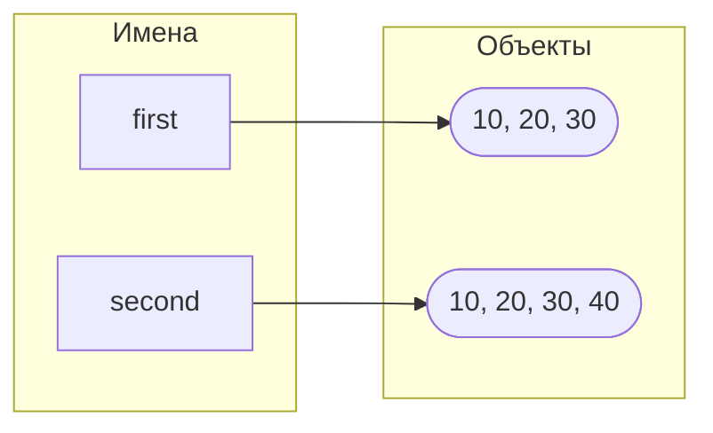

# Лабораторная работа № 2. Управление объектами и памятью в Python

## Цель работы

Исследовать связь между именами и объектами, понять различия между присваиванием, поверхностным и глубоким копированием, а также познакомиться с механизмами управления памятью в CPython.

### Задание 1. Имена, ссылки и изменяемость.

#### Эксперимент A. Неизменяемый объект.

Результат вывода:

```python
10 10
4360002920 4360002920
11 10
4360002952 4360002920
```

Значение, связанное с именем b, не поменялось так как имя a создало новый объект в памяти и теперь ссылается на него

#### Эксперимент B. Изменяемый объект.

Результат вывода до изменения кода:

```python
[10, 20] [10, 20]
4309502336 4309502336
[10, 20, 30] [10, 20, 30]
4309502336 4309502336
```
Дополняем код следующими строками:

```python
second = first.copy()
print('second == first: ', second == first)
print('second is first: ', second is first)
second.append(40)
print(first, second)
```
И можем наблюдать, что добавление нового элемента в список `second` не повлияло на список `first`:

```python
second == first:  True
second is first:  False
[10, 20, 30] [10, 20, 30, 40]
```
Схема связей до переназначения:


И после:



---
Практическая задача

Результат вывода двух конфигураций, одна из которых была сделана обычным присваиванием:

```python
Учебный проект №1:
{'Name': 'Основы программирования', 'Students': ['Лиза', 'Вика'], 'Starts': {'Duration (sec)': 10, 'Amount': 2}}

Учебный проект №2:
{'Name': 'Основы программирования', 'Students': ['Лиза', 'Вика'], 'Starts': {'Duration (sec)': 10, 'Amount': 2}}
```

Попытаемся поменять название учебного проекта в `project2` и выведем названия двух проектов:

```python
Введение в Linux
Введение в Linux
```

Мы получили нежелательное совместное изменение
Создадим независимую конфигурцию `project2` путем использования `copy.deepcopy(project1)`. В данном случае у нас создается глубокая копия (со всеми данными внутри словаря), но две конфигурации теперь ссылаются на два разных объекта в памяти. Поменяем данные в `project2` и подтвердим независимость с помощью `assert`:

```python
project2['Name'] = 'Алгоритмы и структуры данных'
project2['Students'] = ['Сережа', 'Рита', 'Лиза', 'Аня']

assert project1['Name'] == 'Основы программирования'
assert project1['Students'] == ['Лиза', 'Вика']

assert project2['Name'] == 'Алгоритмы и структуры данных'
assert project2['Students'] == ['Сережа', 'Рита', 'Лиза', 'Аня']
```
Вывод двух конфигураций и общих объектов:

```python
Учебный проект №1:
{'Name': 'Основы программирования', 'Students': ['Лиза', 'Вика'], 'Starts': {'Duration (sec)': 10, 'Amount': 2}}

Учебный проект №2:
{'Name': 'Алгоритмы и структуры данных', 'Students': ['Сережа', 'Рита', 'Лиза', 'Аня'], 'Starts': {'Duration (sec)': 10, 'Amount': 2}}

Общие объекты:
Name, Students, Starts, 10, 2, Лиза
Остальные объекты являются независимыми
```

Если бы независимость не подтвердилась, то нам выдавало бы ошибку `AssertionError`

**Вопросы:**

1. Нет, не меняет, а всего лишь создает еще одно имя, которое будет ссылаться на тот же объект, что и первое имя
2. Потому что в Python нельзя изменять неизменяемый объект в памяти, поэтому при любой операции с ним в памяти создается новый измененный объект
3. С помощью оператора `is`

### Задание 2. Поверхностное и глубокое кодирование
